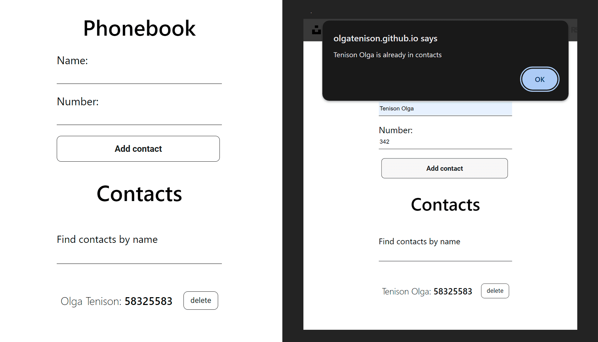

  

# goit-react-hw-06-phonebook

This repository contains the source code for a phonebook web application,
refactored using React and state management with Redux Toolkit.

## Features

1. **Add Contacts:** Users can add new contacts by providing a name and phone
   number.

2. **Remove Contacts:** Users can delete saved contacts that are no longer
   needed.

3. **Search Contacts:** Provides the ability to quickly search for contacts by
   name.

4. **Local Storage:** Contacts are stored in the local storage of the browser,
   providing persistence across sessions.

5. **Redux State Management:** The application now uses Redux Toolkit for
   efficient state management.

6. **Redux Persist:** Utilizes Redux Persist to save and rehydrate the Redux
   store, ensuring a seamless experience even after a page refresh.

## Technologies

1. **React:** Utilizes the React library and functional components with hooks.

2. **Nanoid:** Used for generating unique identifiers for contacts.

3. **Redux Toolkit:** Implements efficient state management with Redux Toolkit.

4. **Redux Persist:** Ensures persistence of Redux state across sessions.

## Getting Started

1. Clone the repository to your computer:
   `git clone https://github.com/yourusername/goit-react-hw-06-phonebook.git`

2. Install dependencies: `npm install`

3. Run the application: `npm start`

Feel free to customize this description according to your project and its
specifics.

Start template:
[Create React App](https://github.com/facebook/create-react-app).
